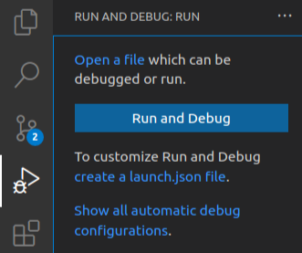
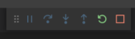

# Errores, errores, errores...
Son muchas las ocasiones en las que hacemos una pieza de software que funciona bien, pero no hace lo que
necesitamos. Es decir, a pesar de que nos _compile_ y no haya errores, las cosas no funcionan.
Sucede que hay un enemigo/amigo (depende de tu tolerancia) para las y los programadores: errores de lógica.

## Errores de lógica
Básicamente hay dos tipos de errores: los de "toda la vida", como _Syntax error_, _Index error_, etc.
Y los errores de lógica.
Los primeros son fáciles de detectar, porque literalmente Python te dice cuándo y dónde existen estos
problemas en tu código. Te dice: Syntax error en la línea 20.
Los errores lógicos son silenciosos, Python no te dice dónde está el punto de fallo.

### ¿Cómo tratar estos errores?
Para llegar a saber dónde nuestro código _quiebra_, debemos seguir su flujo. Es decir, no solo leer el
programa con cuidado, sino seguir el paso a paso del tratado de los datos. Se podría decir que te imagines
que ingresaste x input y ahora vas paso a paso, viendo cómo el estado de ese input cambia.

Por lo general así se resuelven errores de bucles, condicionales y demás flujos básicos del programa.
Pero cuando tratamos con listas, funciones o ambas, seguir el hilo del programa se vuelve más complejo.

# Debugging
Debugging es el proceso de encontrar y corregir errores. Si bien se puede usar para errores _"normales"_,
son más comúnmente usados para tratar errores de lógica, ya que es el debugging nos ayuda a encontrar
errores que Python no ve.

## ¿Cómo se hace debugging?
Cada editor de código o IDE, posee una herramienta para hacer debugging (la mayoría, notepad no tiene :b).
En python, la podemos identificamos como _Run and debug_, ubicado en el menú izquierdo. Al darle clic,
nos abre el siguiente menú:

A continuación, pinchamos el botón azul que pone **run and debug**. Después se nos abre un menú donde
escogeremos la opción _Python file_. Nos aparecerá este menú:

### ¿Cómo usarlo?
Debido a que son cosas que se explican mejor de manera práctica y que cada IDE tiene un fucionamiento
diferente de la herramienta de debugging, una documentación se queda corta. Así que les invito a buscar
en Internet <3

# En conclusión...
Hacer debug nos ayuda a encontrar los fallos lógicos en nuestro código de los que nuestro IDE no nos avisa.
Nos ayuda a observar el estado de nuestro código y variables paso a paso y así saber qué y dónde está
fallando nuestro programa.